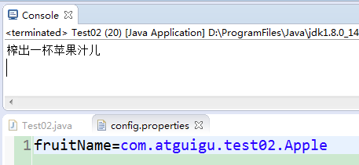
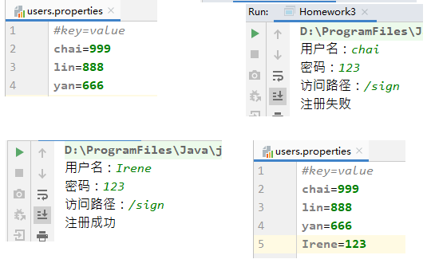

# 第17章_反射机制拓展练习

讲师：尚硅谷-宋红康

网址：www.atguigu.com

***

## 关于Class

### 1、获取Class对象

使用4种方式获取java.time.LocalDate类的Class对象，并打印输出。

```java
package com.atguigu.exercise1;

import java.time.LocalDate;

public class Exercise1 {
    public static void main(String[] args){
        try {
            Class c1 = LocalDate.class;
            Class c2 = LocalDate.now().getClass();
            Class c3 = Class.forName("java.time.LocalDate");
            Class c4 = ClassLoader.getSystemClassLoader().loadClass("java.time.LocalDate");

            System.out.println("c1 = " + c1);
            System.out.println("c2 = " + c2);
            System.out.println("c3 = " + c3);
            System.out.println("c4 = " + c4);
        } catch (ClassNotFoundException e) {
            e.printStackTrace();
        }
    }
}
```

## 反射的应用

### 2、创建对象

（1）通过反射创建java.util.Date类的对象。

（2）通过反射创建java.time.LocalDate类的对象。

```java
package com.atguigu.exercise2;

import org.junit.Test;

import java.lang.reflect.Constructor;

public class Exercise2 {
    @Test
    public void test01() throws Exception {
        Class clazz = Class.forName("java.util.Date");
        Object nowObj = clazz.newInstance();
        System.out.println(nowObj);
    }
    @Test
    public void test02() throws Exception{
        Class clazz = Class.forName("java.time.LocalDate");
        Constructor constructor = clazz.getDeclaredConstructor(int.class, int.class, int.class);
        constructor.setAccessible(true);
        Object obj = constructor.newInstance(2022, 2, 4);
        System.out.println("obj = " + obj);
    }
}

```

### 3、修改属性值

已知有如下字符串：

```java
String str = "hello";
```

通过反射修改str对象的"hello"为"hallo"。

```java
package com.atguigu.exercise3;

import java.lang.reflect.Field;

public class Exercise3 {
    public static void main(String[] args) throws Exception{
        String str = "hello";
        
        Class clazz = str.getClass();
        Field valueField = clazz.getDeclaredField("value");
        valueField.setAccessible(true);
        char[] value = (char[]) valueField.get(str);
        value[1] = 'a';

        System.out.println("str = " + str);
    }
}
```

### 4、调用方法

通过反射分别调用java.time.LocalDate的如下方法：

- public static LocalDate now()
- public LocalDate plusDays(long daysToAdd)

```java
package com.atguigu.exercise4;

import java.lang.reflect.Method;

public class Exercise4 {
    public static void main(String[] args)throws Exception{
        Class clazz = Class.forName("java.time.LocalDate");
        Method nowMethod = clazz.getMethod("now");
        Object obj = nowMethod.invoke(null);
        System.out.println("obj = " + obj);

        Method plusDaysMethod = clazz.getMethod("plusDays", long.class);
        Object future = plusDaysMethod.invoke(obj, 100);
        Syste.out.println("future = " + future);
    }
}
```

### 5、获取类型信息

通过反射获取java.time.LocalDate类的详细信息。

```java
package com.atguigu.exercise5;

import java.lang.reflect.Constructor;
import java.lang.reflect.Field;
import java.lang.reflect.Method;
import java.lang.reflect.Modifier;

public class Exercise5 {
    @Test
    public void test() throws ClassNotFoundException {
        //1、先得到某个类型的Class对象
        Class clazz = Class.forName("java.time.LocalDate");

        //2、获取类信息
        //（1）获取包对象，即所有java的包，都是Package的对象
        Package pkg = clazz.getPackage();
        System.out.println("包名：" + pkg.getName());

        //（2）获取修饰符
        int mod = clazz.getModifiers();
        System.out.println("类的修饰符有：" + Modifier.toString(mod));

        //（3）类型名
        String name = clazz.getName();
        System.out.println("类名：" + name);

        //（4）父类，父类也有父类对应的Class对象
        Class superclass = clazz.getSuperclass();
        System.out.println("父类：" + superclass);

        //（5）父接口们
        System.out.println("父接口们：");
        Class[] interfaces = clazz.getInterfaces();
        for (Class iter : interfaces) {
            System.out.println(iter);
        }

        //（6）类的属性，你声明的一个属性，就是一个Field的对象
        System.out.println("------------------------------");
        System.out.println("成员如下：");
        System.out.println("属性有：");
        Field[] declaredFields = clazz.getDeclaredFields();
        for (Field field : declaredFields) {
            //修饰符、数据类型、属性名
            int modifiers = field.getModifiers();
            System.out.println("属性的修饰符：" + Modifier.toString(modifiers));

            String name2 = field.getName();
            System.out.println("属性名：" + name2);

            Class<?> type = field.getType();
            System.out.println("属性的数据类型：" + type);
        }
        System.out.println("-------------------------");
        //（7）构造器们
        System.out.println("构造器列表：");
        Constructor[] constructors = clazz.getDeclaredConstructors();
        for (int i = 0; i < constructors.length; i++) {
            Constructor constructor = constructors[i];
            System.out.println("第" + (i + 1) + "个构造器：");
            //修饰符、构造器名称、构造器形参列表  、抛出异常列表
            int modifiers = constructor.getModifiers();
            System.out.println("构造器的修饰符：" + Modifier.toString(modifiers));

            String name2 = constructor.getName();
            System.out.println("构造器名：" + name2);

            //形参列表
            System.out.println("形参列表：");
            Class[] parameterTypes = constructor.getParameterTypes();
            for (Class parameterType : parameterTypes) {
                System.out.println(parameterType);
            }

            //异常列表
            System.out.println("异常列表：");
            Class<?>[] exceptionTypes = constructor.getExceptionTypes();
            for (Class<?> exceptionType : exceptionTypes) {
                System.out.println(exceptionType);
            }
            System.out.println();
        }
        System.out.println("---------------------------------");
        //(8)方法们
        System.out.println("方法列表：");
        Method[] declaredMethods = clazz.getDeclaredMethods();
        for (int i = 0; i < declaredMethods.length; i++) {
            Method method = declaredMethods[i];
            System.out.println("第" + (i + 1) + "个方法：");
            //修饰符、返回值类型、方法名、形参列表 、异常列表
            int modifiers = method.getModifiers();
            System.out.println("方法的修饰符：" + Modifier.toString(modifiers));

            Class<?> returnType = method.getReturnType();
            System.out.println("返回值类型:" + returnType);

            String name2 = method.getName();
            System.out.println("方法名：" + name2);

            //形参列表
            System.out.println("形参列表：");
            Class[] parameterTypes = method.getParameterTypes();
            for (Class parameterType : parameterTypes) {
                System.out.println(parameterType);
            }

            //异常列表
            System.out.println("异常列表：");
            Class<?>[] exceptionTypes = method.getExceptionTypes();
            for (Class<?> exceptionType : exceptionTypes) {
                System.out.println(exceptionType);
            }
            System.out.println();
        }
    }
}
```

### 6、榨汁机

案例：榨汁机(Juicer)榨汁的案例，分别有水果(Fruit)苹果(Apple)香蕉(Banana)桔子(Orange)榨汁(squeeze)

效果：



开发提示：

​	1、声明(Fruit)水果接口，包含榨汁抽象方法：void squeeze();

​	2、声明榨汁机(Juicer)，包含运行方法：public void run(Fruit f)，方法体中，调用f的榨汁方法squeeze()

​	3、声明各种水果类，实现(Fruit)水果接口，并重写squeeze();

​	4、在src下，建立配置文件：config.properties，并在配置文件中配上fruitName=xxx（其中xx为某种水果的全类名）

​	5、在Test02测试类中，

​	（1）读取配置文件，获取水果类名，并用反射创建水果对象，

​	（2）创建榨汁机对象，并调用run()方法

```java
package com.atguigu.exercise6;

import java.util.Properties;

public class Exercise6 {
	@Test
    public void test() throws Exception {
        Properties pro = new Properties();
        pro.load(Exercise6.class.getClassLoader().getResourceAsStream("config.properties"));
        Class<?> clazz = Class.forName(pro.getProperty("fruitName"));
        Fruit f = (Fruit) clazz.newInstance();
        Juicer j = new Juicer();
        j.run(f);
    }
}

interface Fruit {
	public void squeeze();
}

class Juicer {
	public void run(Fruit f) {
		f.squeeze();
	}

}
class Apple implements Fruit {
	public void squeeze() {
		System.out.println("榨出一杯苹果汁儿");
	}
}

class Orange implements Fruit {
	public void squeeze() {
		System.out.println("榨出一杯桔子汁儿");
	}
}


```

### 7、获取泛型参数

代码填空题

```java
package com.atguigu.exercise7;

import java.lang.reflect.ParameterizedType;

public class Exercise7 {
	public static void main(String[] args) {
		SubA a = new SubA();
		System.out.println(a.getType());
		
		SubB b = new SubB();
		System.out.println(b.getType());
	}
}
abstract class Base<T>{
	private Class type;
	
	public Base(){
		//为type属性赋值为T的实际类型
        
        _____________________________________
	}

	public Class getType() {
		return type;
	}
}
class SubA extends Base<String>{

}
class SubB extends Base{

}
```

```java
package com.atguigu.exercise7;

import java.lang.reflect.ParameterizedType;

public class Exercise7 {
	public static void main(String[] args) {
		SubA a = new SubA();
		System.out.println(a.getType());
		
		SubB b = new SubB();
		System.out.println(b.getType());
	}
}
abstract class Base<T>{
	private Class type;
	
	public Base(){
		Class<? extends Base> clazz = this.getClass();
		try {
			ParameterizedType pt = (ParameterizedType) clazz.getGenericSuperclass();
			type = (Class) pt.getActualTypeArguments()[0];
		} catch (Exception e) {
			type = Object.class;
		}
	}

	public Class getType() {
		return type;
	}
}
class SubA extends Base<String>{

}
class SubB extends Base{

}
```


### 8、自定义注解1

（1）声明自定义注解类型MyAnnotation，

- 注解使用位置只能是方法上面
- 注解声明周期为RetentionPolicy.RUNTIME
- 注解包含抽象方法：String value();

（2）在主方法上标记MyAnnotation注解，并且为抽象方法value()指定返回值“主方法”

（3）在主方法中读取MyAnnotation注解信息，并调用value()抽象方法获取返回值，打印返回值。

```java
package com.atguigu.exercise8;

import java.lang.annotation.ElementType;
import java.lang.annotation.Retention;
import java.lang.annotation.RetentionPolicy;
import java.lang.annotation.Target;

@Target(ElementType.METHOD)
@Retention(RetentionPolicy.RUNTIME)
public @interface MyAnnotation {
    String value();
}

```

```java
package com.atguigu.exercise8;

import java.lang.reflect.Method;

public class Exercise8 {
    @MyAnnotation("主方法")
    public static void main(String[] args) {
        try {
            Class clazz = Exercise8.class;
            Method mainMethod = clazz.getMethod("main", String[].class);
            MyAnnotation myAnnotation = mainMethod.getAnnotation(MyAnnotation.class);
            String value = myAnnotation.value();
            System.out.println("value = " + value);
        } catch (NoSuchMethodException e) {
            e.printStackTrace();
        }
    }
}

```

### 9、自定义注解2

案例：

​	1、声明自定义注解@Table

​	（1）加上String类型的配置参数value

​	（2）并限定@Table的使用位置为类上

​	（3）并指定生命周期为“运行时”

​	2、声明自定义注解@Column

​	（1）加上String类型的配置参数name，表示表格的列名

​	（2）加上String类型的配置参数type，表示表格的列数据类型

​	（3）并限定@Column的使用位置在属性上

​	（4）并指定生命周期为“运行时”

​	3、声明User类，

​	（1）属性：id, username, password, email

​	（2）在User类上，标记@Table注解，并为value赋值为"t_user"

​	（3）在User类的每一个属性上标记@Column，并为name和type赋值，例如：

​		id：name赋值为no，type赋值为int

​		username：name赋值为username，type赋值为varchar(20)

​		password：name赋值为pwd，type赋值为char(6)

​		email：name赋值为email，type赋值为varchar(50)

​	4、在测试类Test04中，通过反射，获取User类以及每一个属性声明的注解，并获取注解值

​	运行效果：


```java
package com.atguigu.exercise9;

import java.lang.annotation.ElementType;
import java.lang.annotation.Retention;
import java.lang.annotation.RetentionPolicy;
import java.lang.annotation.Target;

@Target(ElementType.TYPE)
@Retention(RetentionPolicy.RUNTIME)
public @interface Table {
	String value();
}

```

```java
package com.atguigu.Exercise9;

import java.lang.annotation.ElementType;
import java.lang.annotation.Retention;
import java.lang.annotation.RetentionPolicy;
import java.lang.annotation.Target;

@Target(ElementType.FIELD)
@Retention(RetentionPolicy.RUNTIME)
public @interface Column {
	String name();
	String type();
}
```

```java
package com.atguigu.exercise9;

@Table("t_user")
public class User {
	@Column(name="no",type="int")
	private int id;
	
	@Column(name="username",type="varchar(20)")
	private String username;
	
	@Column(name="pwd",type="char(6)")
	private String password;
	
	@Column(name="email",type="varchar(50)")
	private String email;
	
	public User(int id, String username, String password, String email) {
		super();
		this.id = id;
		this.username = username;
		this.password = password;
		this.email = email;
	}
	public User() {
		super();
	}
	public int getId() {
		return id;
	}
	public void setId(int id) {
		this.id = id;
	}
	public String getUsername() {
		return username;
	}
	public void setUsername(String username) {
		this.username = username;
	}
	public String getPassword() {
		return password;
	}
	public void setPassword(String password) {
		this.password = password;
	}
	public String getEmail() {
		return email;
	}
	public void setEmail(String email) {
		this.email = email;
	}
	@Override
	public String toString() {
		return "User [id=" + id + ", username=" + username + ", password=" + password + ", email=" + email + "]";
	}
	
}
```

```java
package com.atguigu.exercise9;

import java.lang.reflect.Field;

public class Exercise9 {
	@Test
    public void test() throws NoSuchFieldException {
        Class clazz = User.class;

        Table t = (Table) clazz.getAnnotation(Table.class);
        String table = t.value();
        System.out.println("User类对应数据库表：" + table);

        Field idField = clazz.getDeclaredField("id");
        Column idColumn = idField.getAnnotation(Column.class);
        String idName = idColumn.name();
        String idType = idColumn.type();
        System.out.println("id属性对应数据库表的字段：" + idName + "，类型：" + idType);

        Field usernameField = clazz.getDeclaredField("username");
        Column usernameColumn = usernameField.getAnnotation(Column.class);
        String usernameName = usernameColumn.name();
        String usernameType = usernameColumn.type();
        System.out.println("username属性对应数据库表的字段：" + usernameName + "，类型：" + usernameType);

        Field passwordField = clazz.getDeclaredField("password");
        Column passwordColumn = passwordField.getAnnotation(Column.class);
        String passwordName = passwordColumn.name();
        String passwordType = passwordColumn.type();
        System.out.println("password属性对应数据库表的字段：" + passwordName + "，类型：" + passwordType);

        Field emailField = clazz.getDeclaredField("email");
        Column emailColumn = emailField.getAnnotation(Column.class);
        String emailName = emailColumn.name();
        String emailType = emailColumn.type();
        System.out.println("email属性对应数据库表的字段：" + emailName + "，类型：" + emailType);
    }
}

```

## 综合练习

### 10、AtguiguDemo

案例：用反射获取某个类的信息，并用反射使用某个类

开发提示：

​	1、声明一个类：com.atguigu.test01.demo.AtguiguDemo，

​	（1）包含静态变量：学校school（显式初始化为"尚硅谷"）

​	（2）包含属性：班级名称className

​	（3）并提供构造器，get/set等

​	（4）实现Serializable和Comparable接口（按照班级名称排序）

​	2、把com.atguigu.test01.demo.Exercise10class导出为一个atguigu.jar并放到D:\ProgramFiles\Java\jdk1.8.0_141\jre\lib\ext目录（注意，以你自己的JDK安装目录为准）

​	3、在测试类Test01的test01()测试方法中，用反射获取AtguiguDemo类的Class对象，并获取它的所有信息，包括类加载器、包名、类名、父类、父接口、属性、构造器、方法们等。

​	4、在测试类Test01的test02()测试方法中，用反射获取school的值，并修改school的值为“尚硅谷大学”，然后再获取school的值

​	5、在测试类Test01的test03()测试方法中，用反射创建AtguiguDemo类的对象，并设置班级名称className属性的值，并获取它的值

​	6、在测试类Test01的test04()测试方法中，用反射获取有参构造创建2个AtguiguDemo类的对象，并获取compareTo方法，调用compareTo方法，比较大小。

```java
import java.lang.reflect.Constructor;
import java.lang.reflect.Field;
import java.lang.reflect.Method;
import java.lang.reflect.Modifier;
import java.lang.reflect.ParameterizedType;
import java.util.Arrays;

import org.junit.Test;

public class Exercise10 {
	@Test
	public void test01() throws ClassNotFoundException{
		Class clazz = Class.forName("com.atguigu.test01.demo.AtguiguDemo");
		
		ClassLoader classLoader = clazz.getClassLoader();
		System.out.println("类加载器：" + classLoader);
		
		Package pkg = clazz.getPackage();
		System.out.println("包名：" + pkg.getName());
		
		int cMod = clazz.getModifiers();
		System.out.println("类的修饰符：" + Modifier.toString(cMod));
		
		System.out.println("类名：" + clazz.getName());
		System.out.println("父类：" + clazz.getSuperclass().getName());
		Class[] interfaces = clazz.getInterfaces();
		System.out.println("父接口们："+Arrays.toString(interfaces));
		
		Field[] declaredFields = clazz.getDeclaredFields();
		for (int i =0 ;i<declaredFields.length; i++) {
			System.out.println("第" + (i+1) + "个字段：");
			int fMod = declaredFields[i].getModifiers();
			System.out.println("修饰符：" + Modifier.toString(fMod));
			System.out.println("数据类型："  + declaredFields[i].getType().getName());
			System.out.println("属性名：" + declaredFields[i].getName());
		}
		
		Constructor[] declaredConstructors = clazz.getDeclaredConstructors();
		for (int i = 0; i < declaredConstructors.length; i++) {
			System.out.println("第" + (i+1) + "个构造器：");
			int csMod = declaredConstructors[i].getModifiers();
			System.out.println("修饰符：" + Modifier.toString(csMod));
			System.out.println("构造器名：" + declaredConstructors[i].getName());
			System.out.println("形参列表：" + Arrays.toString(declaredConstructors[i].getParameterTypes()));
		}
		
		Method[] declaredMethods = clazz.getDeclaredMethods();
		for (int i = 0; i < declaredMethods.length; i++) {
			System.out.println("第" + (i+1) + "个成员方法：");
			int csMod = declaredMethods[i].getModifiers();
			System.out.println("修饰符：" + Modifier.toString(csMod));
			System.out.println("返回值类型：" + declaredMethods[i].getReturnType().getName());
			System.out.println("方法名：" + declaredMethods[i].getName());
			System.out.println("形参列表：" + Arrays.toString(declaredMethods[i].getParameterTypes()));
		}
	}
	
	@Test
	public void test02() throws Exception{
		Class clazz = Class.forName("com.atguigu.test01.demo.AtguiguDemo");
		Field field = clazz.getDeclaredField("school");
		field.setAccessible(true);
		Object value = field.get(null);
		System.out.println("school = " + value);
		
		field.set(null, "尚硅谷大学");
		value = field.get(null);
		System.out.println("school = " + value);
	}
	
	@Test
	public void test03() throws Exception{
		Class clazz = Class.forName("com.atguigu.test01.demo.AtguiguDemo");
		Object object = clazz.newInstance();
		Field field = clazz.getDeclaredField("className");
		field.setAccessible(true);
		Object value = field.get(object);
		System.out.println("className = " + value);
		
		field.set(object, "190513班");
		value = field.get(object);
		System.out.println("className = " + value);
	}
	
	@Test
	public void test04() throws Exception{
		Class clazz = Class.forName("com.atguigu.test01.demo.AtguiguDemo");
		Constructor c = clazz.getDeclaredConstructor(String.class);
		Object obj1 = c.newInstance("190513BJ班");
		Object obj2 = c.newInstance("190325SH班");
		
		Method m = clazz.getDeclaredMethod("compareTo", Object.class);
		System.out.println("obj1与obj2比较结果：" + m.invoke(obj1, obj2));
	}
}

```

```java
package com.atguigu.exercise10;

import java.io.Serializable;

public class AtguiguDemo implements Serializable,Comparable<AtguiguDemo>{
	private static final long serialVersionUID = 1L;
	private static String school = "尚硅谷";
	private String className;
	public AtguiguDemo(String className) {
		super();
		this.className = className;
	}
	public AtguiguDemo() {
		super();
	}
	public static String getSchool() {
		return school;
	}
	public static void setSchool(String school) {
		AtguiguDemo.school = school;
	}
	public String getClassName() {
		return className;
	}
	public void setClassName(String className) {
		this.className = className;
	}
	@Override
	public String toString() {
		return "AtguiguDemo [className=" + className + "]";
	}
	@Override
	public int compareTo(AtguiguDemo o) {
		return this.className.compareTo(o.getClassName());
	}
}

```

### 11、AtguiguStudent

（1）声明一个尚硅谷学生类AtguiguStudent，

- 包含静态变量：学校school

- 包含属性：班级名称className

- 并提供构造器，get/set等

- 实现Serializable
- 实现Comparable<T>接口，重写int compareTo(T t)方法按照班级名称排序

（2）在测试类的test01()测试方法中，用反射获取AtguiguStudent类的Class对象，并获取它的所有信息，包括类加载器、包名、类名、父类、父接口、属性、构造器、方法们等。

（3）在测试类的test02()测试方法中，用反射设置school的值为“尚硅谷”，获取school的值

（4）在测试类的test03()测试方法中，用反射创建AtguiguStudent类的对象，并设置班级名称className属性的值，并获取它的值

（5）在测试类的test04()测试方法中，用反射获取有参构造创建2个AtguiguStudent类的对象，并获取compareTo方法，调用compareTo方法，比较大小。

```java
import java.io.Serializable;

public class AtguiguStudent implements Serializable,Comparable<AtguiguStudent>{
    private static final long serialVersionUID = 1L;
    private static String school = "尚硅谷";
    private String className;
    public AtguiguStudent(String className) {
        super();
        this.className = className;
    }
    public AtguiguStudent() {
        super();
    }
    public static String getSchool() {
        return school;
    }
    public static void setSchool(String school) {
        AtguiguStudent.school = school;
    }
    public String getClassName() {
        return className;
    }
    public void setClassName(String className) {
        this.className = className;
    }
    @Override
    public String toString() {
        return "AtguiguDemo [className=" + className + "]";
    }
    @Override
    public int compareTo(AtguiguStudent o) {
        return this.className.compareTo(o.getClassName());
    }

}

```

```java
import org.junit.Test;

import java.lang.reflect.Constructor;
import java.lang.reflect.Field;
import java.lang.reflect.Method;
import java.lang.reflect.Modifier;
import java.util.Arrays;

public class Exercise11 {
    @Test
    public void test01() throws ClassNotFoundException{
        Class clazz = Class.forName("com.atguigu.homework1.AtguiguStudent");

        ClassLoader classLoader = clazz.getClassLoader();
        System.out.println("类加载器：" + classLoader);

        Package pkg = clazz.getPackage();
        System.out.println("包名：" + pkg.getName());

        int cMod = clazz.getModifiers();
        System.out.println("类的修饰符：" + Modifier.toString(cMod));

        System.out.println("类名：" + clazz.getName());
        System.out.println("父类：" + clazz.getSuperclass().getName());
        Class[] interfaces = clazz.getInterfaces();
        System.out.println("父接口们："+ Arrays.toString(interfaces));

        Field[] declaredFields = clazz.getDeclaredFields();
        for (int i =0 ;i<declaredFields.length; i++) {
            System.out.println("第" + (i+1) + "个字段：");
            int fMod = declaredFields[i].getModifiers();
            System.out.println("修饰符：" + Modifier.toString(fMod));
            System.out.println("数据类型："  + declaredFields[i].getType().getName());
            System.out.println("属性名：" + declaredFields[i].getName());
        }

        Constructor[] declaredConstructors = clazz.getDeclaredConstructors();
        for (int i = 0; i < declaredConstructors.length; i++) {
            System.out.println("第" + (i+1) + "个构造器：");
            int csMod = declaredConstructors[i].getModifiers();
            System.out.println("修饰符：" + Modifier.toString(csMod));
            System.out.println("构造器名：" + declaredConstructors[i].getName());
            System.out.println("形参列表：" + Arrays.toString(declaredConstructors[i].getParameterTypes()));
        }

        Method[] declaredMethods = clazz.getDeclaredMethods();
        for (int i = 0; i < declaredMethods.length; i++) {
            System.out.println("第" + (i+1) + "个成员方法：");
            int csMod = declaredMethods[i].getModifiers();
            System.out.println("修饰符：" + Modifier.toString(csMod));
            System.out.println("返回值类型：" + declaredMethods[i].getReturnType().getName());
            System.out.println("方法名：" + declaredMethods[i].getName());
            System.out.println("形参列表：" + Arrays.toString(declaredMethods[i].getParameterTypes()));
        }
    }

    @Test
    public void test02() throws Exception{
        Class clazz = Class.forName("com.atguigu.homework1.AtguiguStudent");
        Field field = clazz.getDeclaredField("school");
        field.setAccessible(true);
        field.set(null, "尚硅谷");
        Object value = field.get(null);
        System.out.println("school = " + value);
    }

    @Test
    public void test03() throws Exception{
        Class clazz = Class.forName("com.atguigu.test01.demo.AtguiguDemo");
        Object object = clazz.newInstance();
        Field field = clazz.getDeclaredField("className");
        field.setAccessible(true);
        Object value = field.get(object);
        System.out.println("className = " + value);

        field.set(object, "190513班");
        value = field.get(object);
        System.out.println("className = " + value);
    }

    @Test
    public void test04() throws Exception{
        Class clazz = Class.forName("com.atguigu.homework1.AtguiguStudent");
        Constructor c = clazz.getDeclaredConstructor(String.class);
        Object obj1 = c.newInstance("20210513BJ班");
        Object obj2 = c.newInstance("20210325SH班");

        Method m = clazz.getDeclaredMethod("compareTo", Object.class);
        System.out.println("obj1与obj2比较结果：" + m.invoke(obj1, obj2));
    }
}

```

### 12、自定义注解

（1）声明注解类型PathAnnotation

- 使用Target元注解限定注解使用位置：ElementType.TYPE
- 使用Retention元注解限定注解的生命周期：RetentionPolicy.RUNTIME
- 声明抽象方法String value()

（2）在当前模块根目录下包含一个users.properties文件，里面包含如下内容：=左边是用户名，=右边是密码

```java
#key=value
chai=999
lin=888
yan=666
admin=123456
```

（3）声明抽象类MyServlet，包含抽象方法：

public abstract void service(HashMap<String,String>  map)throws Exception; 

（4）声明LoginServlet类，继承MyServlet类，重写service方法，遍历map，如果里面包含key为username和password的键值对，则取出对应的值，并判断它和users.properties文件中用户名和密码是否匹配，如果用户名和密码都匹配则输出“登录成功”，否则输出“登录失败”。在LoginServlet类加注解PathAnnotation("/login")。

（5）声明SignServlet类，继承MyServlet类，重写service方法，遍历map，如果里面包含key为username和password的键值对，则取出对应的值，并判断它和users.properties文件中用户名是否重复，如果用户名已存在则输出“注册失败”，否则输出“注册成功”，并把新的用户名和密码追加到users.properties文件新的一行。在SignServlet类加注解PathAnnotation("/sign")。

（6）在src包含一个servlet.properties文件，并包含

```java
servletClass=所有MyServlet类子类的全名称（每个类使用,分割）
```

（7）在测试类中，

- 创建HashMap<String,Class>集合对象pathsMap。
- 读取servlet.properties文件，获取所有MyServlet类子类的全名称，根据“,"拆分所有类名。
- 根据上面拆分的类名，通过Class.forName(类名)方法获取所有MyServlet类子类的Class对象，并读取在它们上面定义的PathAnnotation注解，并将PathAnnotation注解值作为key，对应的Class对象作为value存放到pathsMap中。
- 从键盘输入用户名和密码，并创建HashMap<String,String>，添加"username=输入的用户名"，"password=输入的密码"两个(key,value)键值对。
- 从键盘输入路径名，通过反射创建对应Servlet对象，并调用对应类的service方法，完成登录或注册功能。

（8）代码结构如下


（9）运行效果如下：




```java
import java.lang.annotation.ElementType;
import java.lang.annotation.Retention;
import java.lang.annotation.RetentionPolicy;
import java.lang.annotation.Target;

@Target(ElementType.TYPE)
@Retention(RetentionPolicy.RUNTIME)
public @interface PathAnnotation {
    String value();
}
```

```java
#key=value
chai=999
lin=888
yan=666
admin=123456
```

```java
import java.util.HashMap;

public abstract class MyServlet {
    public abstract void service(HashMap<String,String>  map)throws Exception;
}

```

```java
import java.io.FileInputStream;
import java.util.HashMap;
import java.util.Map;
import java.util.Properties;
import java.util.Set;

@PathAnnotation("/login")
public class LoginServlet extends MyServlet {
    @Override
    public void service(HashMap<String,String> map) throws Exception{
        Set<Map.Entry<String, String>> entries = map.entrySet();
        String username = "";
        String password = "";
        for (Map.Entry<String, String> entry : entries) {
            String key = entry.getKey();
            String value = entry.getValue();
            if("username".equals(key)){
                username = value;
            }else if("password".equals(key)){
                password = value;
            }
        }

        Properties properties = new Properties();
        properties.load(new FileInputStream("day21_homework/users.properties"));
        String value = properties.getProperty(username);
        if(value != null && password.equals(value)){
            System.out.println("登录成功");
        }else{
            System.out.println("登录失败");
        }
    }
}

```

```java
import java.io.FileInputStream;
import java.io.FileWriter;
import java.util.HashMap;
import java.util.Map;
import java.util.Properties;
import java.util.Set;

@PathAnnotation("/sign")
public class SignServlet extends MyServlet {
    @Override
    public void service(HashMap<String, String> map) throws Exception {
        Set<Map.Entry<String, String>> entries = map.entrySet();
        String username = "";
        String password = "";
        for (Map.Entry<String, String> entry : entries) {
            String key = entry.getKey();
            String value = entry.getValue();
            if("username".equals(key)){
                username = value;
            }else if("password".equals(key)){
                password = value;
            }
        }

        Properties properties = new Properties();
        properties.load(new FileInputStream("day21_homework/users.properties"));
        String value = properties.getProperty(username);
        if(value == null){
            System.out.println("注册成功");
            FileWriter fw = new FileWriter("day21_homework/users.properties",true);
            fw.write("\r\n" + username+"="+password);
            fw.close();
        }else{
            System.out.println("注册失败");
        }
    }
}

```

```java
servletClass=com.atguigu.exercise13.LoginServlet,com.atguigu.exercise13.SignServlet
```

```java
package com.atguigu.exercise13;

import java.util.HashMap;
import java.util.Properties;
import java.util.Scanner;

public class Exercise13 {
    public static void main(String[] args) throws Exception{
        HashMap<String,Class> pathsMap = new HashMap<>();
        Properties properties = new Properties();
        properties.load(LoginServlet.class.getClassLoader().getResourceAsStream("servlet.properties"));
        String servletClasses = properties.getProperty("servletClass");
        String[] classNames = servletClasses.split(",");
        for (String className : classNames) {
            Class<?> clazz = Class.forName(className);
            PathAnnotation pathAnnotation = clazz.getAnnotation(PathAnnotation.class);
            if(pathAnnotation != null){
                String path = pathAnnotation.value();
                pathsMap.put(path, clazz);
            }
        }

        Scanner input = new Scanner(System.in);
        System.out.print("用户名：");
        String username = input.next();

        System.out.print("密码：");
        String password = input.next();

        System.out.print("访问路径：");
        String path = input.next();

        HashMap<String,String> map = new HashMap<>();
        map.put("username",username);
        map.put("password",password);

        Class servletClass = pathsMap.get(path);
        MyServlet servlet = (MyServlet) servletClass.newInstance();
        servlet.service(map);

        input.close();
    }
}
```

